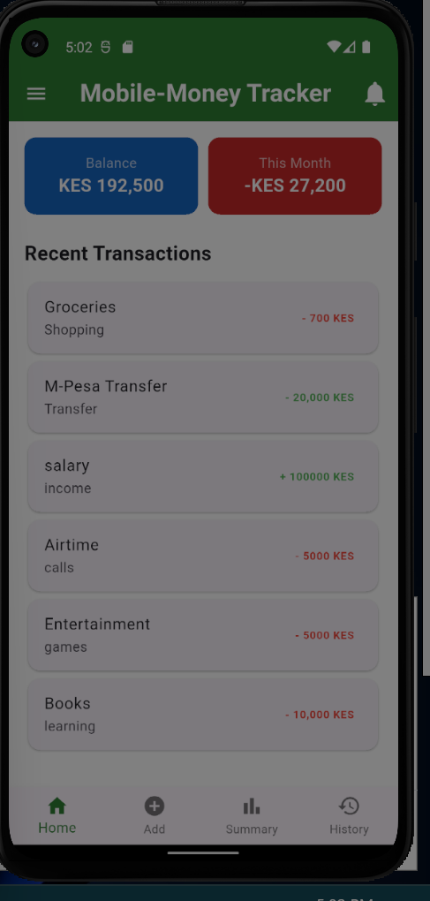
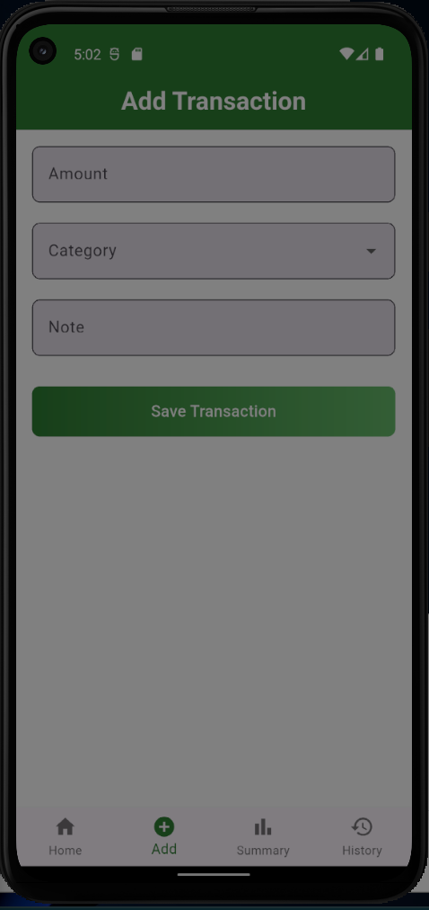
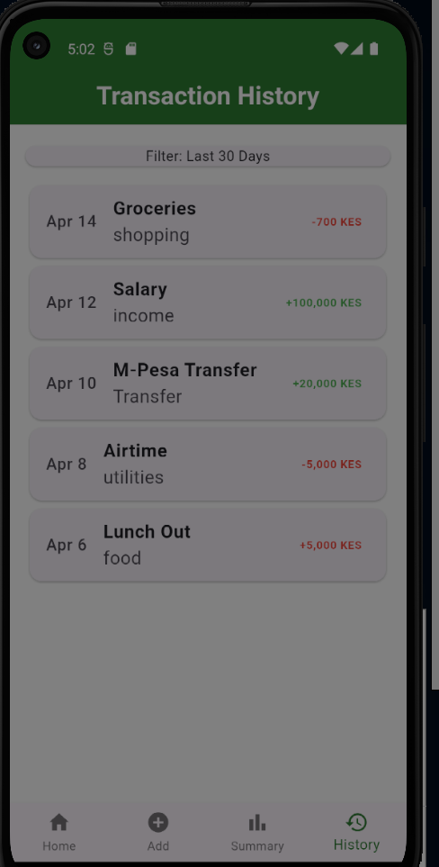

# 📱 Mobile-Money Tracker

A professional-grade **Flutter** financial application built to track daily transactions, monitor balances, and visualize spending habits. This project features a high-fidelity User Experience (UX) with custom animations and a modular code architecture.

---

## 📸 App Preview

| Full-Screen Splash | Home Screen | Add Transaction |
| :---: | :---: | :---: |
|  |  |  |

| Spending Summary | Transaction History |
| :---: | :---: |
|  |  |

---

## ✨ Key Features

* **Immersive Animated Splash:** A custom full-screen entry experience featuring an "emerging" brand animation with `AnimatedScale` and `AnimatedOpacity`.
* **Financial Dashboard:** High-contrast cards for real-time tracking of current balance and monthly expenditures.
* **Data Visualization:** Interactive **Pie Charts** (via `fl_chart`) to provide a visual breakdown of spending distribution.
* **Smart Categorization:** Intuitive transaction logging for categories such as Groceries, Salary, and Transfers.
* **Clean History Management:** Transaction logs organized with individual cards and custom date-stamped dividers for maximum scannability.
* **Responsive UI:** Fully optimized for various device sizes with a cohesive "Money-Green" theme.

## 🛠️ Tech Stack

* **Framework:** Flutter (Web & Mobile)
* **Language:** Dart
* **Animations:** Flutter Implicit Animations (`Curves.easeOutBack`)
* **Charts:** `fl_chart` library
* **Icons:** Material Design Icons

## 🚀 Installation & Setup

1. **Clone the project:**
   ```bash
   git clone [https://github.com/kamau-David/Mobile_Money_Tracker.git](https://github.com/kamau-David/Mobile_Money_Tracker.git)